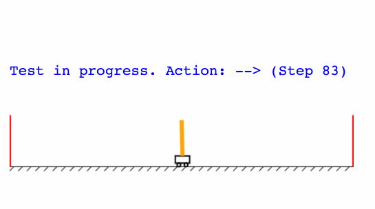

This project is trying to solve the classic [cart-pole balancing problem](https://gym.openai.com/envs/CartPole-v0/), sometimes refered to as the 'hello world' of reinforcement
learning.

Specifically, it showcases an implementation of the policy-gradient method in TensorFlow.js with a combination of the layers and gradients API.
Try the demo [here](https://storage.googleapis.com/tfjs-examples/cart-pole/dist/index.html) to visualise, the training and testing in the browser.

Please train this on a laptop or desktop only.