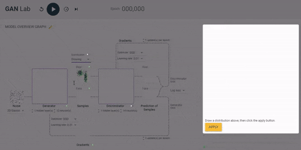

GAN Lab is a browser-based interactive visualisation to help you learn about
[Generative Adversarial Networks](https://en.wikipedia.org/wiki/Generative_adversarial_network),
or GANs as they are also known.

Users can interactively train Generative Adversarial Networks (GANs), and visually examine the model training
process.

It was made by Minsuk Kahng, Nikhil Thorat,
Duen Horng (Polo) Chau, Fernanda B. Viegas, and Martin Wattenberg.
You can read the full white paper [here](https://minsuk.com/research/papers/kahng-ganlab-vast2018.pdf)

It uses TensorFlow.js, and in many ways similar to the
[TensorFlow Playground](https://playground.tensorflow.org), a similar
browser-based interactive visualisation to help people understand how Neural Networks work.

Try it out [here](https://poloclub.github.io/ganlab/)