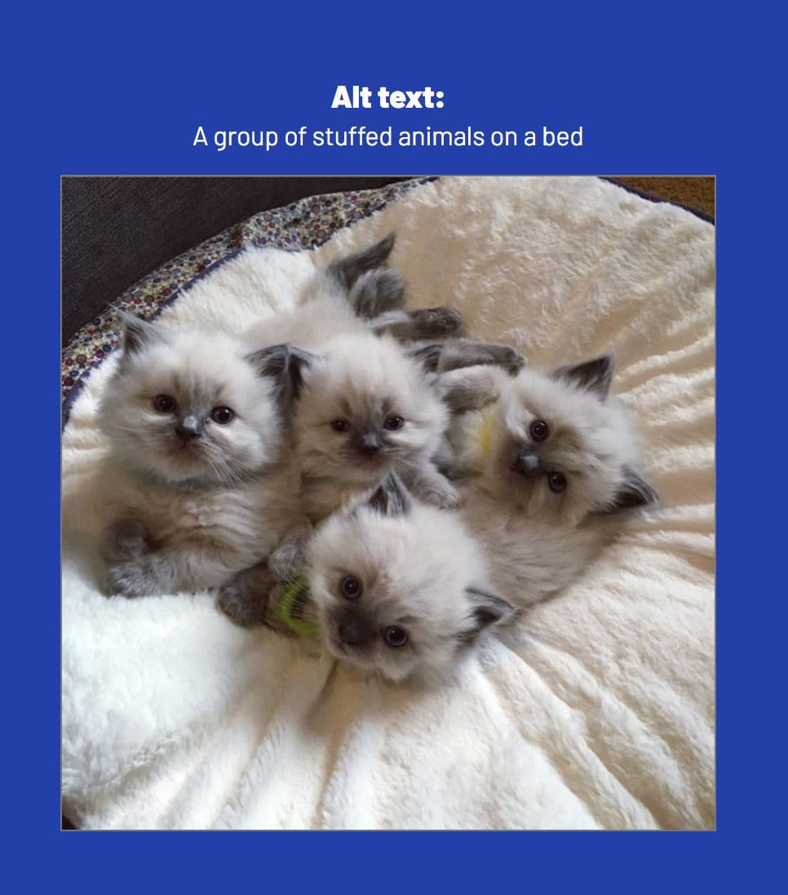
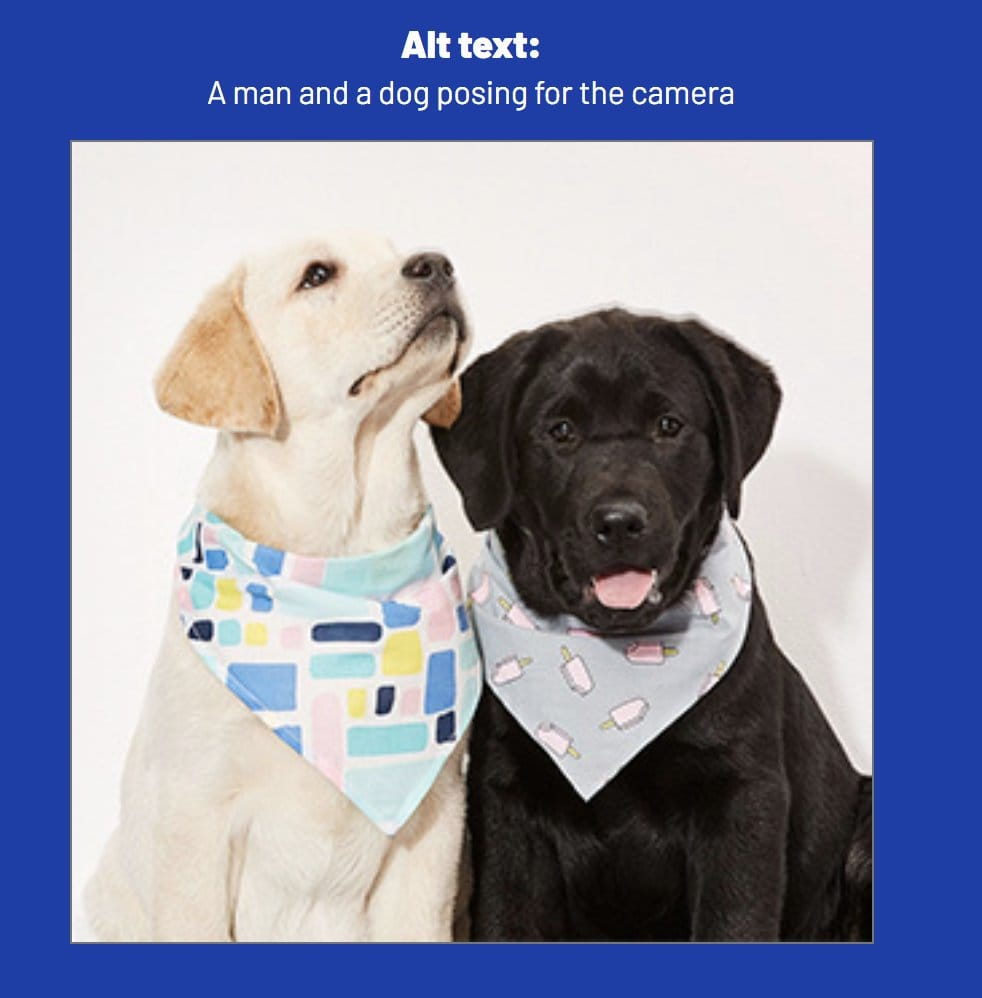
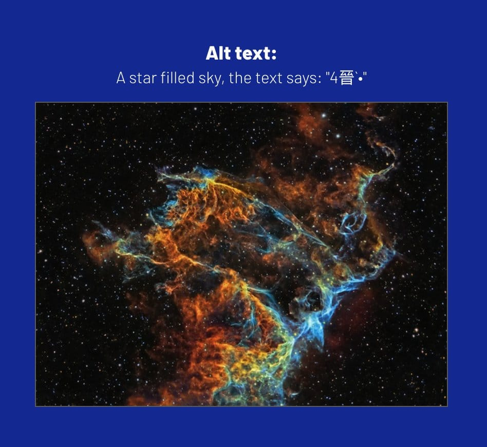

A proof of concept codepen by Sarah demonstrating how to use the Azure Computer Vision API to generate alt text for images.

It's as simple as passing the image to the API and returning information about the image including a sentence describing what it thinks is in the image.

<figure class="video_container">
  <video controls="true" autoplay loop allowfullscreen="true" poster="./img/img-alt-text-generator.jpg">
    <source src="./img/img-alt-text-generator.mp4" type="video/mp4">
  </video>
</figure>

Ok it's not perfect, but better than nothing and some of the results are pretty interesting.

https://twitter.com/FrontendNE/status/930120267992616960

https://twitter.com/SniCy/status/930189562923634693

https://twitter.com/chrispiecom/status/930407801402347520

https://twitter.com/ollee/status/930303340516216832

