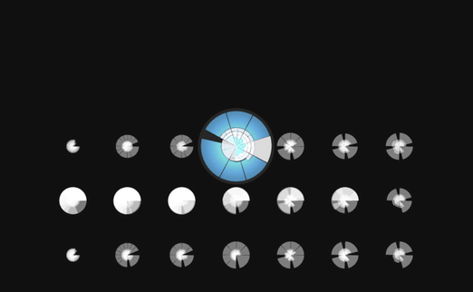

This is a generative music experiment based on the
[Multitrack MusicVAE](https://magenta.tensorflow.org/multitrack) model from
[Google Magenta](https://magenta.tensorflow.org/).

It presents a 7x7 grid of musical measures, which you can move around in freely
to play music. Each row in the grid is an interpolation between two measures in
the latent space. Each column represents a decoding of the same measure for 7
different chords.

You can play the app by just improvising - moving around randomly and making
shapes. Or you can play tonal chord progressions by using the keyboard shortcuts
1-7 to switch to the I-VII chords respectively.

The app uses [Magenta.js](https://github.com/tensorflow/magenta-js) (and
[TensorFlow.js](https://js.tensorflow.org/)) to generate the measures and
[Tone.js](https://tonejs.github.io/) to sequence the music. The visuals are
built in [Three.js](https://threejs.org/).

Try the [demo on Glitch](https://incredible-spinners.glitch.me/).
