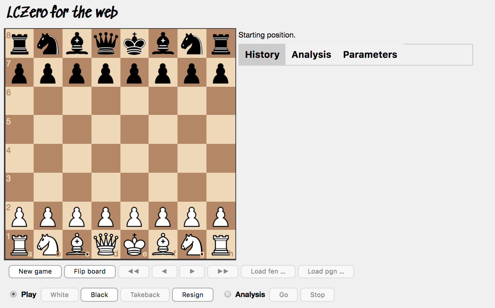

Play chess against an AI in your browser!

The opensource [Alpha Zero](https://en.wikipedia.org/wiki/AlphaZero) project
has been ported to JavaScript using [TensorFlow.js](https://js.tensorflow.org/)
and runs inside your browser.

The [lc0 engine](https://github.com/LeelaChessZero/lc0) runs in the browser, without any server computational resources, without need of any pluggins, and works offline with Web Workers (depending on your browser).
 TensorFlow.js runs the Neural Network, and uses the GPU to accelerate the computations with WebGL.

Have a play with the demo [here](https://frpays.github.io/lc0-js/engine.html)