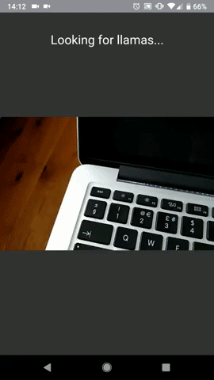

[Llama Vision](https://llama.vision) uses Tensorflow.js and a pre-trained [MobileNet model](https://github.com/tensorflow/tfjs-models/tree/master/mobilenet) to detect llamas through your desktop or mobile phone camera.

You can try the demo [here](https://llama.vision) in a modern web browser. There's also [a blog post here](https://medium.com/samsung-internet-dev/introducing-llama-vision-a-website-that-detects-llamas-through-your-camera-aa6f16144ac4) for more information and the full story behind it!
