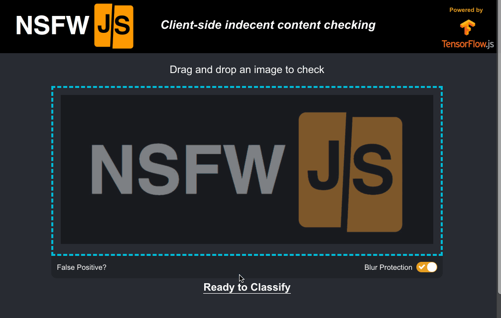

    ---
title: "Avoid Nightmares - NSFW JS"
demo: https://nsfwjs.com/
code: https://github.com/infinitered/nsfwjs
link: https://shift.infinite.red/avoid-nightmares-nsfw-js-ab7b176978b1
date: "2019-02-19"
path: "/inspire/nsfw-js"
thumbnail: "./img/nsfw.jpeg"
author: "Gant Laborde"
authorAvatar: https://pbs.twimg.com/profile_images/664163024983330816/AX5wMLcm_400x400.jpg
authorLink: https://twitter.com/josephpaulcohen
shortDescription: "Client-side indecent content checking for the soul"
tags:
  - TensorFlow.js
  - Computer Vision
  - Image Recognition
layout: "inspire"
---

NSWF.js is a library to identify indecent images.

Simply pass the model an image or canvas element and it will return
information on whether the content is provocative or indecent.

As this is using machine learning in the browser, with TensorFlow.js, the
files never actully have to leave the client’s machine. This is a big bonus of using
machine learning in the browser. As the creator Gant Laborde states - 'Just like
client-side form validation causes less work for your server,
client-side content checking can cause less work for your team.'

Try it out [here](https://nsfwjs.com/)