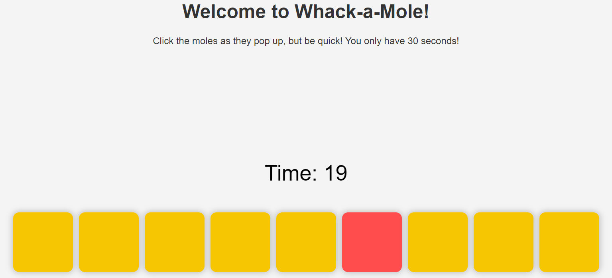

Pushy Pushy is part of [Web AI Apps](https://WebAIApps.com)

It generates casual JavaScript games. There is an option to request improvement of the game, with or without user feedback.

Uses the [OpenAI PHP API client](https://github.com/openai-php/client), user must provide OpenAI API key.
